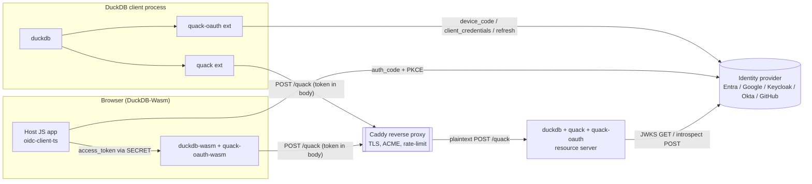
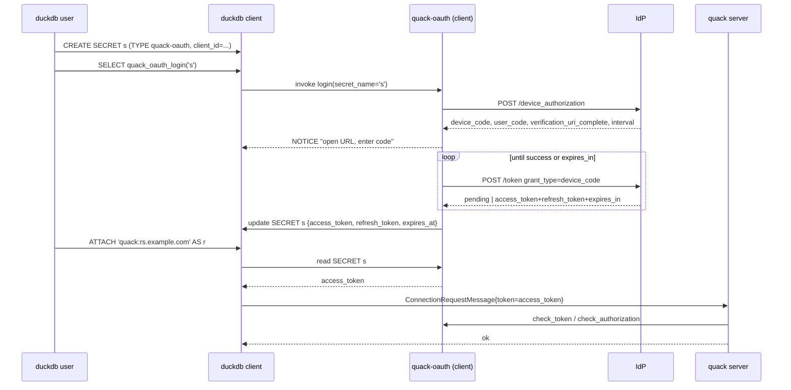
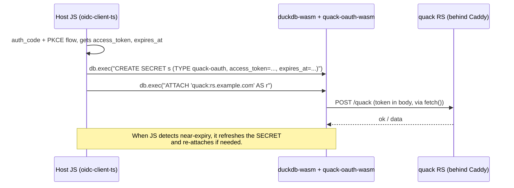
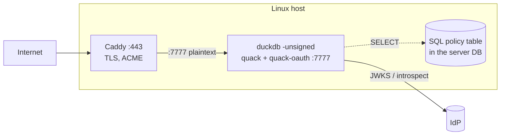

# quack-oauth — Architecture (arc42)

Status: draft v0.1 (2026-05-14)
Companion to `requirements.md` in this directory.

---

## 1. Introduction and goals

`quack-oauth` is a DuckDB extension that adds OAuth 2.1 / OpenID
Connect authentication and a claims-driven authorization model to
the `duckdb-quack` client/server protocol, without modifying
`duckdb-quack` itself.

Top quality goals, in priority order:

1. **Standards-correct security.** RFC 6749/8628/7662/7519/7517,
   OIDC Core 1.0. No bespoke crypto.
2. **Minimum code, minimum dependencies.** ≤ 2.5 kSLOC C++, ≤ 4
   third-party libs, statically linked.
3. **One source tree → six targets.** Linux x86_64/aarch64, macOS
   x86_64/arm64, Windows x86_64, wasm32.
4. **Drop-in.** Pure plug-in into quack's existing callback +
   secret-type extension points. Zero changes to quack's wire format.
5. **Operable.** Discoverable settings, a single diagnostic
   function, structured logs without secret leakage.

## 2. Constraints

| # | Constraint | Source |
|---|---|---|
| C-1 | Must not modify `duckdb-quack` source. | User scope |
| C-2 | Caddy is a TLS terminator only; the extension validates tokens itself. | User decision |
| C-3 | Token rides inside `ConnectionRequestMessage` (in-RPC), not as an HTTP header. | User decision |
| C-4 | Must compile to wasm32 (DuckDB-Wasm) from the same tree. | User decision |
| C-5 | OAuth flows in client: `client_credentials` + `device_code` + `refresh_token`. PKCE-in-host-JS for browser. | User decision |
| C-6 | Validation modes: JWKS-local and RFC 7662 introspection, configurable. | User decision |
| C-7 | Build via vcpkg+CMake (DuckDB extension template). | duckdb-quack convention |
| C-8 | Dependencies must be statically linkable. | User decision |
| C-9 | First-class supported providers: Microsoft Entra ID, Google, Keycloak, Okta, GitHub. | User decision, 2026-05-14 |

## 3. Context and scope



**External actors**: end users (interactive), service jobs (M2M),
browser app users (via host JS), the IdP, and Caddy.

**System boundary**: the `quack-oauth` extension binaries (one
native, one wasm). The IdP, Caddy, and quack itself are external.

## 4. Solution strategy

| Decision | Rationale |
|---|---|
| **Plug into quack's existing scalar-function callbacks** (`quack_check_token`, `quack_nop_authorization`) rather than fork quack. | Zero invasive changes; reversible by toggling `quack_oauth_enabled`. |
| **Two-callback design**: `check_token` does signature/claims validation, `check_authorization` does policy evaluation with a cached principal. | Matches quack's existing surface; cleanly separates AuthN from AuthZ. |
| **Per-process key cache** (`kid → JWK`) and **per-token decision cache** (`hash(token) → {principal, decision_ttl}`). | Sub-100µs hot path while remaining correct on key rotation and `exp`. |
| **Token transport reuses quack's in-RPC `token` slot**; client reconnects when token nears expiry. | No quack wire changes (C-3). Cost: brief reconnect on rotation. |
| **Wasm build strips client-side OAuth code via `#ifdef EMSCRIPTEN`**; the host page injects an already-obtained access token via SECRET. | Browser can't keep client secrets and can't run device_code; defers all flow handling to a JS OIDC library that already exists. |
| **Single header-only JWT library** (`jwt-cpp`) over OpenSSL on native, mbedTLS on wasm. | Cuts JWT code to ~50 LOC of glue. OpenSSL is already in DuckDB's vcpkg orbit. |
| **Policy as a SQL table inside the server's DuckDB database**, addressed by `policy_table` on the server SECRET. | Operators get SQL-native rule management (INSERT / UPDATE / DELETE, joins to existing principal tables) with the same engine they already trust. No extra parser dependency. |
| **No HA, no shared cache**. | Single-process scope (C-1, simplicity). Caches are warmed in seconds. |

## 5. Building-block view

### 5.1 Level 1 (whitebox `quack-oauth`)

```mermaid
flowchart TB
  subgraph QO[quack-oauth extension]
    Reg[Registration]
    Conf[Settings & SECRET schemas]
    AuthN[AuthN engine<br/>validate_token]
    AuthZ[AuthZ engine<br/>evaluate_policy]
    KeyC[(JWKS cache)]
    DecC[(Decision cache)]
    TokSrc[Token source<br/>flows + cache]
    Diag[diagnose()]
  end

  Reg --> Conf
  Reg --> AuthN
  Reg --> AuthZ
  Reg --> TokSrc
  AuthN --> KeyC
  AuthN --> DecC
  AuthZ --> DecC
  AuthZ -.reads.-> Conf
  Diag --> KeyC
  Diag --> DecC
  Diag --> TokSrc

  quack_ext[(duckdb-quack)]
  duckdb_secret[(DuckDB Secret Manager)]
  duckdb_log[(DuckDB log)]
  IdP[(IdP HTTPS)]

  AuthN -- replaces quack_check_token --> quack_ext
  AuthZ -- replaces quack_nop_authorization --> quack_ext
  TokSrc -- reads/writes SECRET --> duckdb_secret
  KeyC -- HTTP GET /jwks --> IdP
  AuthN -- HTTP POST /introspect --> IdP
  TokSrc -- HTTP POST /token, device_authorization --> IdP
  AuthN --> duckdb_log
  AuthZ --> duckdb_log
```

### 5.2 Level 2 building blocks

| Block | Responsibility | Key files (proposed) |
|---|---|---|
| **Registration** | DuckDB `Load()` entry point. Registers settings, SECRET types (`quack-oauth`, `quack-oauth-server`), table/scalar functions, and swaps quack callbacks when `quack_oauth_enabled` is set. | `src/quack_oauth_extension.cpp` |
| **Settings & SECRET schemas** | Pure data. Defines the parameter sets, redaction rules, and env-var overlay. | `src/config.cpp/.hpp` |
| **AuthN engine** | Accepts a raw token string, returns `Principal{sub,iss,scopes,claims,exp}` or rejects. Internally dispatches to `jwks_validator` or `introspect_validator`. | `src/authn.cpp/.hpp`, `src/jwks_validator.cpp`, `src/introspect_validator.cpp` |
| **AuthZ engine** | Accepts `(Principal, Action, Object)`, returns allow/deny + reason. Loads the SQL policy table named by the SECRET's `policy_table` field via a short-lived `Connection`; falls back to the default scope policy when unset. | `src/authz.cpp/.hpp`, `src/policy.cpp`, `src/policy_table.cpp` |
| **JWKS cache** | Thread-safe `kid → JWK` with per-`kid` rate-limited refresh. | `src/jwks_cache.cpp/.hpp` |
| **Decision cache** | `sha256(token) → {Principal, decision_ttl}`. LRU, 60 s TTL, capped at `min(60s, exp-now)`. | `src/decision_cache.cpp/.hpp` |
| **Token source (client)** | Native-only. Implements client_credentials, device_code, refresh_token. Updates the SECRET in place. | `src/client/token_source.cpp/.hpp` (`#ifdef EMSCRIPTEN` → stub) |
| **Diagnose** | Single table function dumping cache state and last N decisions. | `src/diagnose.cpp` |
| **Platform** | The only place with `#ifdef`. Wraps HTTP (cpp-httplib vs Emscripten fetch), random (OpenSSL vs Web Crypto via JS bridge). No filesystem dependency for the policy: it lives in the host DuckDB database. | `src/platform/*.cpp` |

## 6. Runtime view

### 6.1 Server-side authentication on connection

```
quack server receives ConnectionRequestMessage{token}
  └─> calls quack_oauth_check_token(token)
        ├─ dec_cache.lookup(hash(token))
        │   └─ hit & not expired → return ok, set thread-local principal
        ├─ if validation_mode == jwks:
        │   ├─ parse JWT header, read kid
        │   ├─ jwks_cache.get(kid) (refresh if absent, with rate-limit)
        │   ├─ verify signature, iss, aud, exp, nbf, alg ∈ allowlist
        │   └─ extract Principal
        ├─ if validation_mode == introspect:
        │   ├─ POST {token=…} to introspection_endpoint with client auth
        │   └─ require active=true
        ├─ dec_cache.put(hash(token), Principal, ttl=min(60s, exp-now))
        └─ return ok
```

### 6.2 Server-side authorization per operation

```
quack invokes quack_oauth_check_authorization(token, action, object)
  └─ Principal = dec_cache.lookup(hash(token))   // never empty here
     if Principal.exp <= now: re-run AuthN (forces fresh JWKS / introspect)
     evaluate policy(Principal, action, object) → allow/deny+reason
     // Rules come from SQL: SELECT * FROM <secret.policy_table> ORDER BY priority;
     // Fall back to the default scope policy when policy_table is unset.
     log decision (sub, action, object, decision, reason)
```

### 6.3 Client-side token acquisition (native, device_code)



### 6.4 Client-side near-expiry reconnect

```
on next query touching attached server r:
  if SECRET.expires_at - now < renew_skew_s:
    if refresh_token present:
      POST /token grant_type=refresh_token → new access_token, expires_at
    else if client_credentials configured:
      POST /token grant_type=client_credentials
    else:
      raise InvalidInputException("re-run quack_oauth_login")
    update SECRET
    quack: disconnect; reconnect with new token
  proceed
```

### 6.5 Wasm browser path



## 7. Deployment view



**Caddy** sample, conceptual:

```caddyfile
rs.example.com {
  reverse_proxy 127.0.0.1:7777
  encode zstd gzip
  request_body { max_size 64MB }
  log { ... }
}
```

Caddy holds no auth state. The same artefact runs behind nginx,
HAProxy, or directly on `localhost` for dev. There is no
`forward_auth` plug-in dependency.

For the **Wasm deployment**, the extension is fetched as a
`.duckdb_extension.wasm` by DuckDB-Wasm. The host JS bundles
`oidc-client-ts` (or equivalent) and is responsible for token
acquisition and renewal.

## 8. Cross-cutting concepts

### 8.1 Configuration

Layered, deterministic:

```
DuckDB SET ⟶ SECRET ⟶ environment ⟶ compile-time defaults
```

Discoverable: every setting is registered with DuckDB so it appears
in `duckdb_settings()`.

### 8.2 Logging

Single helper that takes a structured key=value map, hashes any
field flagged as sensitive (`token`, `client_secret`, `id_token`,
`refresh_token`) before emitting at the chosen level. Tokens never
appear in plaintext, even at TRACE.

### 8.3 Error handling

- Boundary errors (network, IdP) → retry with backoff, then
  `IOException` surfaced to DuckDB.
- AuthN failures → `PermissionException` with a stable reason code
  (`invalid_signature`, `expired`, `wrong_audience`, `revoked`,
  `policy_denied:<rule>`).
- Config errors at LOAD → fatal, prevent extension from loading.

### 8.4 Threading

Per-process caches behind `std::mutex` (or `std::shared_mutex` for
JWKS reads). DuckDB-Wasm builds use `-pthread=0` cooperative
threading; no spawned threads in the extension. The token-source
poll loop is implemented with cooperative time slicing on Wasm
(via Emscripten async) and a single thread on native.

### 8.5 Testing

- **Unit**: JWT parsing fixtures, JWKS rotation, policy-evaluator cases.
- **Integration**: ephemeral Keycloak container in CI; live device
  flow scripted via Keycloak admin API; introspection mode toggled.
- **Provider matrix** (release-blocking): recorded-transcript
  end-to-end tests for each first-class provider — Entra ID, Google,
  Keycloak, Okta (custom AS), GitHub — covering token acquisition,
  ATTACH, allowed scan, denied scan. Recordings are captured against
  live tenants once per release and replayed deterministically in CI.
- **SQL tests**: `test/sql/*.test` per duckdb-quack convention,
  covering ATTACH, scoped scans, denials, near-expiry reconnect.
- **Wasm smoke test**: Playwright page that drives DuckDB-Wasm,
  injects a token, runs an attach against a localhost RS.

### 8.6 Provider compatibility

The AuthN engine dispatches via a small `Provider` strategy table
selected by the `quack_oauth_provider` setting. Each provider entry
supplies: default `iss` template, JWKS URI template, validation mode
(jwks | introspect | github), introspection endpoint (if applicable),
claim-mapping function (`raw → Principal`), and supported flow set.

```mermaid
flowchart LR
  Token[Raw token] --> Dispatch{Provider}
  Dispatch -- entra --> JWKSv[JWKS verify<br/>iss=login.microsoftonline.com/{tid}/v2.0]
  Dispatch -- keycloak --> JWKSv
  Dispatch -- okta --> JWKSv2[JWKS verify<br/>iss={org}/oauth2/{authServerId}]
  Dispatch -- google --> TokInfo[GET tokeninfo<br/>oauth2.googleapis.com]
  Dispatch -- github --> GHCheck[POST applications/{client_id}/token<br/>HTTP-Basic client_id:secret]
  Dispatch -- generic --> JWKSv
  JWKSv --> Principal
  JWKSv2 --> Principal
  TokInfo --> Principal
  GHCheck --> GHMap[map user.login→preferred_username<br/>user.id→sub gh:N<br/>scopes[]→scope] --> Principal
```

| Provider | Validation path | Claim mapping notes |
|---|---|---|
| **Entra ID** | jwks-cpp; verify `iss`, `aud=client_id/api://…`, `tid` claim allowlist | `oid`/`sub`, `roles[]`/`scp`→scope, `preferred_username`, `tid` retained |
| **Google** | introspect via `tokeninfo` | `sub`, `scope` (space-delimited), `email` (verified flag respected), no audience guarantee — caller supplies expected `aud` and we compare |
| **Keycloak** | jwks-cpp; verify `iss=realm`, `aud=client_id` or `azp`-fallback | `realm_access.roles[]`, `resource_access.{client}.roles[]` → scope, `preferred_username` |
| **Okta** | jwks-cpp **only against custom AS** (`/oauth2/{id}`); refuse org AS | `sub`, `scp[]`→scope, `groups[]` (when configured) |
| **GitHub** | POST `/applications/{client_id}/token` with HTTP-Basic; expect 200 + JSON | `sub=gh:{user.id}`, `preferred_username=user.login`, `scope=` GitHub OAuth scopes, `email` only if verified |
| **generic** | jwks-cpp with operator-supplied issuer/jwks_uri/audience | OIDC-standard claims only |

The provider table lives in `src/providers.cpp` and is the only
provider-aware code. All other layers (AuthZ, caches, logging) see
only the normalised `Principal`.

### 8.7 Build & packaging

- DuckDB extension template (vcpkg + CMake).
- vcpkg manifest pins: `openssl`, `jwt-cpp`. `picojson` and
  `duckdb_httplib` vendored as single headers.
- CI matrix: `{linux-x64, linux-arm64, macos-x64, macos-arm64,
  windows-x64, wasm32-emscripten}` × `{release}`.
- Artefacts statically linked; only libc / libSystem / ucrt and
  OpenSSL (where DuckDB already dynamically links it) remain
  dynamic.

## 9. Architecture decisions (ADRs, condensed)

| ID | Decision | Alternatives considered | Why |
|---|---|---|---|
| ADR-1 | Plug into quack's existing scalar callbacks instead of forking quack. | Fork; submit upstream PRs. | Zero churn upstream; reversible; respects C-1. |
| ADR-2 | Reuse the in-RPC token slot, not an HTTP Authorization header. | Patch quack to read `Authorization`. | C-3 user decision; avoids upstream changes; cost is one reconnect on near-expiry. |
| ADR-3 | JWT validation library = `jwt-cpp` (header-only). | Hand-roll with OpenSSL EVP; libjwt (C). | Smallest glue (~50 LOC), portable, header-only. |
| ADR-4 | Policy as a SQL table in the server's DuckDB database, addressed by `policy_table` on the server SECRET. | YAML file on disk; Rego/OPA; a plug-in evaluator API. | The host is already a DuckDB process — reusing its query engine eliminates an external parser (no yaml-cpp dep) and lets operators manage rules with `INSERT`/`UPDATE`/`DELETE`, joins to existing principal tables, transactions, etc. The default scope policy (R-S-8) still applies when no table is configured. |
| ADR-5 | Wasm build does no OAuth; host JS does. | Port flows to Wasm. | Browser security model can't keep secrets; JS OIDC libraries already excellent; saves ~30% of code. |
| ADR-6 | Local JWKS validation as default; introspection optional. | Always-introspect. | Sub-ms hot path; resilient to IdP blips; introspection still available for revocation-sensitive setups. |
| ADR-7 | One process, in-memory caches; no shared store. | Redis-backed cache. | Single-process scope; warming takes seconds. |
| ADR-8 | Force-fail if `quack_oauth_enabled` and plaintext exposure is detected. | Warn only. | Defence against Caddy misconfig leaking bearer tokens. |
| ADR-9 | First-class provider set is fixed at **Entra, Google, Keycloak, Okta, GitHub**; encoded as a small strategy table, not a plug-in API. | Plug-in-loadable providers; generic-only with operator config. | Five providers cover ~all target deployments; a strategy table is ~100 LOC and stays in the size budget; a plug-in API would double the surface and the test burden. |
| ADR-10 | **GitHub uses its non-standard `applications/{client_id}/token` check**, not RFC 7662, and synthesises `sub=gh:{user.id}`. | Reject GitHub; pretend GitHub is OIDC. | GitHub doesn't issue JWTs or implement 7662; we accept a thin adapter rather than excluding the most-requested IdP. The adapter is isolated to `providers.cpp` so the rest of the AuthN engine remains standards-only. |
| ADR-11 | **Google AT validation uses `tokeninfo`, not local JWKS**, because Google ATs are opaque. ID tokens are validated separately, best-effort, only to enrich claims. | Require Google to issue JWT ATs (not possible); validate ID token as bearer (wrong audience semantics). | Matches Google's actual token model; keeps the bearer-of-record semantics intact. |
| ADR-12 | **Okta requires a custom authorization server**; the org AS is refused at config time. | Accept org AS and live with opaque ATs. | The org AS's AT is only valid for Okta APIs and is not a usable bearer for third-party resource servers; failing loud at config time prevents a confusing runtime-only failure mode. |

## 10. Quality scenarios

| Scenario | Stimulus | Expected response |
|---|---|---|
| **IdP key rotation** | IdP rotates signing key; old JWKS cached. | First request with new `kid` triggers a single JWKS fetch; subsequent requests hit cache. Old key remains for tokens still bearing it until `exp`. |
| **IdP outage** | IdP unreachable for 10 min. | `jwks` mode keeps serving with cached JWKS; new tokens with unknown `kid` rejected with `unknown_kid`. `introspect` mode rejects new tokens immediately; cached decisions continue to honour their TTL. |
| **Token rotation mid-session** | Client's AT expires while attached. | Client renews via refresh_token (or re-flows), updates the SECRET, transparently reconnects on next operation. |
| **Policy update** | Operator `UPDATE`s or `INSERT`s rows in the policy table. | Next request to `check_authorization` re-`SELECT`s and uses the new rules immediately. No file watch, no restart, no extension reload. |
| **Wasm session** | Browser tab open >1 h; AT expires. | Host JS refreshes token via JS OIDC lib, updates SECRET, next query re-attaches. |
| **Malicious client** | Client presents `alg:none` JWT. | Rejected at parse with `disallowed_alg`. |
| **Misconfig** | `enabled=true`, listener on `0.0.0.0`, no `trust_plaintext`. | Extension refuses to load; clear error message. |

## 11. Risks and technical debt

| Risk | Likelihood | Impact | Mitigation |
|---|---|---|---|
| Reusing in-RPC token slot means tokens are not visible to Caddy for header-level decisions (rate-limits by user, etc.). | Certain (design) | Low–medium | Document. If needed later, propose upstream patch to quack to also accept `Authorization` header; non-breaking. |
| SQL-table policy is too coarse for some operators (e.g. row-level predicates beyond the priority/subject/scope/action shape). | Medium | Medium | The AuthZ callback is the same shape regardless of backend; swapping in an OPA/Cedar evaluator, or extending the table schema, is a contained change. |
| OpenSSL static linking footprint on Wasm. | Medium | Medium | Use mbedTLS via jwt-cpp's mbedTLS backend for the Wasm target; benchmark size. |
| Token-rotation reconnect cost. | Low | Low | Skew (`renew_skew_s`) tunable; reconnects only on near-expiry, amortised. |
| Cache poisoning via tokens with colliding `jti`. | Very low | Low | Cache keys are `sha256(raw_token)` not `jti`. |
| Pluggable callback semantics change in future quack versions. | Medium | High | Lock to a minimum quack version in `extension_config.cmake`; CI matrix builds against pinned quack. |

## 12. Glossary

See `requirements.md` §2. Additional terms used here:

- **Principal**: in-memory record `{sub, iss, scopes, claims, exp}`
  produced by the AuthN engine and consumed by the AuthZ engine.
- **Action / Object**: the tuple passed into the AuthZ callback
  (`attach | scan | copy_to | copy_from | serve_admin`, and
  `schema.table` glob respectively).
- **Decision cache**: a process-local LRU keyed by SHA-256 of the
  raw bearer token, valued by `{Principal, ttl}`.
- **Renew skew**: client-side time window before `expires_at` at
  which the extension proactively refreshes / re-flows.
