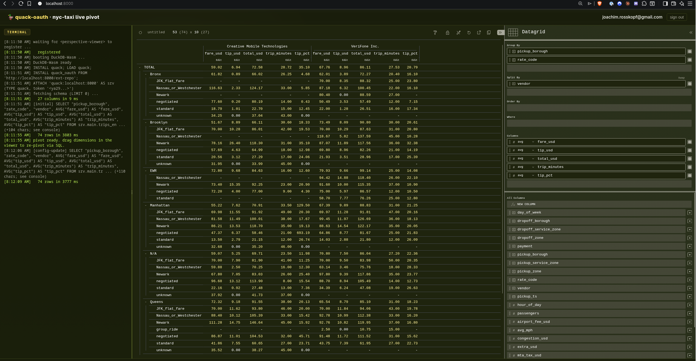

# quack-oauth live demo

A small, self-contained example application that exercises every
moving part of `quack-oauth` end-to-end — and showcases what a
DuckDB-Wasm + Perspective pivot looks like when the heavy lifting
stays on the server.



## What's actually happening

```
        +-----------------------+              +---------------------------+
        |  browser              |              |  python process           |
        |                       |              |                           |
        |  +-----------------+  | http :8000   |  +---------------------+  |
        |  | static HTML +   |<-+--------------+->| aiohttp:            |  |
        |  | DuckDB-Wasm     |  |              |  |  GET  /             |  |
        |  | + Perspective   |  |              |  |  GET  /oauth/login  |  |
        |  +--------+--------+  |              |  |  GET  /oauth/cb     |  |
        |           |           |              |  |  POST /quack        |  |
        |     ATTACH 'quack:    |              |  |  GET  /ext-repo/*   |  |
        |     localhost:8000'   |              |  +-----+---------------+  |
        |     (token 'ya29..')  |              |        |                  |
        |                       |              |        v 127.0.0.1:<rnd>  |
        |     drag chip ->      |              |  +---------------------+  |
        |     SQL roundtrip ->  |              |  | duckdb              |  |
        |     pivot re-renders  |              |  |  quack_serve()      |  |
        |                       |              |  |  quack_oauth_*      |  |
        |                       |              |  |  main.trips_enriched|  |
        |                       |              |  +---------------------+  |
        +-----------+-----------+              +---------------------------+
                    |
                    v Google OAuth Web Server flow
        +-----------------------+
        |  accounts.google.com  |
        +-----------------------+
```

- **Python server** (`uv run quack-oauth-demo`) boots an in-process
  DuckDB, loads `quack` + `quack_oauth`, configures the Google
  provider preset, downloads + caches one month of NYC TLC
  yellow-taxi parquet (~50 MB / 2.7 M trips) into a 26-column
  `main.trips_enriched` view, and runs the quack listener.
- **aiohttp front end** on a single port serves the static client,
  handles the **Google OAuth 2.0 Web Server flow** (login redirect +
  callback that exchanges the code for a `ya29.*` token using the
  app's secret), reverse-proxies `/quack` to the in-process listener,
  and proxies `/ext-repo/*` to `get.erpl.io` with
  `Access-Control-Allow-Origin: *` injected so DuckDB-Wasm can fetch
  the extension binary same-origin. COOP/COEP/CORP middleware sets
  up cross-origin isolation so SharedArrayBuffer is available.
- **Browser client** loads quack + quack_oauth into DuckDB-Wasm,
  `ATTACH`es to the proxied listener with the OAuth token, then
  drives a **FINOS Perspective** `<perspective-viewer>` whose chrome
  is themed to match
  [erpl.io](https://erpl.io). **The pivot interactions translate
  back into SQL `GROUP BY` queries against the server** — the
  browser only ever holds the small aggregate result, not the raw
  2.7M rows. Drop / drag any dimension and watch a new SQL line
  appear in the log on the left.
- **Authentication**: any signed-in Google account with the
  `openid` scope on the project's OAuth consent screen is granted
  Attach + Scan via a single policy rule. The policy is the legacy
  5-column form — kept deliberately simple so the demo's focus stays
  on the OAuth wire + the Perspective pivot. The repo-root README's
  "Authorization → Examples" section walks the upgrade path to
  object-/column-level rules (`object_pattern`, `column_pattern`,
  fine-grained DML actions) if you want to extend this demo.
- **Audit**: every token validation + authz decision lands in
  `main.audit` server-side.

## Prerequisites

- `uv` ([install](https://github.com/astral-sh/uv))
- A **Google Cloud project** with an **OAuth 2.0 Web Application
  client**. Different from a service account — the demo runs the
  human-in-the-loop Web Server flow, not server-to-server
  JWT-bearer.

## One-time setup — Google OAuth client

1. <https://console.cloud.google.com/> → pick (or create) a project.
2. <https://console.cloud.google.com/auth/branding> → fill out
   App information + add yourself to **Test users** under Audience.
3. <https://console.cloud.google.com/auth/scopes> → **Add or
   remove scopes** → tick **only**:
   - `openid`
   - `https://www.googleapis.com/auth/userinfo.email`
   - `https://www.googleapis.com/auth/userinfo.profile`

   (If you add other scopes — Drive, Gmail, Classroom — Google
   will prompt the user for the *union* on the consent screen even
   though our authorize call only requests `openid email profile`.)
4. <https://console.cloud.google.com/apis/credentials> → **Create
   credentials → OAuth client ID**:
   - Application type: **Web application**
   - Authorised JavaScript origins: `http://localhost:8000`
   - Authorised redirect URIs: `http://localhost:8000/oauth/callback`
5. Download the JSON. Either point `.env.demo` at it manually, or
   copy the file to the repo root — the filename is gitignored
   (`client_secret_*.json`).

## Configure the demo

```bash
cd example
cp .env.demo.example .env.demo
# edit .env.demo: paste GOOGLE_DEMO_CLIENT_ID + GOOGLE_DEMO_CLIENT_SECRET
```

## Run

```bash
cd example
uv run quack-oauth-demo
# or: uv run python -m quack_oauth_demo
```

First boot downloads ~50 MB of taxi parquet to `example/cache/`;
subsequent boots are <2 s. Console log:

```
[boot] opening DuckDB + loading quack + quack_oauth
[boot] loading NYC taxi data
[taxi_data] main.trips_enriched ready (2,712,514 rows)
[boot] wiring google auth + policy + audit
[boot] starting quack listener on quack:127.0.0.1:34115
[boot] frontend listening on http://localhost:8000
```

Open <http://localhost:8000>, click **sign in with Google**,
authorise the consent screen, land back on the demo page. Within a
couple of seconds the pivot shows the rows × columns slice in the
screenshot above.

## Driving the pivot

The viewer's **plugin selector** (top-left of the grid toolbar)
exposes 11 visualizations registered by the Perspective d3fc
plugin: **Datagrid** (default) · X Bar · **Y Bar** · X/Y Line · X/Y
Area · X/Y Scatter · Heatmap · Treemap · Sunburst · Candlestick ·
OHLC. Switch by clicking "Datagrid" and picking another.

The right sidebar exposes the standard Perspective shelves —
**Group By**, **Split By**, **Order By**, **Where** (filters),
**Columns** — over the **full 26-column source schema** at all
times. Drag any chip from **All Columns** at the bottom into any of
those shelves.

**Every** drag triggers a new SQL `SELECT … GROUP BY …` against the
server (visible in the log on the left). The browser receives only
the small aggregate result — typically <1 MB regardless of the
underlying 2.7 M rows. Resize the log pane via the yellow drag
handle between it and the viewer.

The data model exposed by `main.trips_enriched`:

| Dimensions | Measures |
|---|---|
| `vendor` (Creative Mobile Technologies / VeriFone Inc.) | `fare_usd`, `extra_usd`, `mta_tax_usd`, `tolls_usd`, `tip_usd` |
| `rate_code` (standard / JFK_flat_fare / Newark / Nassau_or_Westchester / negotiated / group_ride) | `congestion_usd`, `airport_fee_usd`, `total_usd` |
| `payment` (credit_card / cash / no_charge / dispute / other) | `passengers`, `trip_miles`, `trip_minutes`, `avg_mph` |
| `pickup_borough` / `pickup_zone` / `pickup_service_zone` | `tip_pct` (credit-card tips only) |
| `dropoff_borough` / `dropoff_zone` / `dropoff_service_zone` | |
| `hour_of_day` / `day_of_week` | |
| `is_airport_pickup` / `is_airport_dropoff` (JFK 132, LGA 138, EWR 1) | |

## What the demo verifies

| Layer | Showcased by |
|---|---|
| `quack_oauth_check_token` against live Google | every ATTACH; audit row `token_accepted` with subject = your Google account `sub` |
| `quack_oauth_check_authorization` policy table | every query; audit row `authz_allow Scan rule allow` |
| Google provider preset (R-S-12) | server SECRET has no `tenant_or_realm` (preset-fix from commit `89a39d7`) |
| `tokeninfo` decision cache | repeated identical queries: only the first hits `oauth2.googleapis.com/tokeninfo` |
| Quack wire protocol over HTTP | browser devtools: `POST /quack` per query |
| DuckDB-Wasm + custom extension repo | first page load: 200 from `/ext-repo/v1.5.3/wasm_eh/quack_oauth.duckdb_extension.wasm` (which the aiohttp app proxies from `get.erpl.io` with CORS injected) |
| **Server-side SQL pivot** | each drag in the viewer → new SQL line in the log; aggregate computed by DuckDB, not the browser |

## Inspect the server side

The server prints audit rows after each query the browser issues.
You can also peek live by attaching a second DuckDB shell to the
running process via the same quack URI (with your own `ya29.*`
token):

```sql
INSTALL quack; LOAD quack;
ATTACH 'quack:127.0.0.1:8000' AS srv (TYPE quack, token 'ya29.…');
SELECT * FROM srv.main.audit ORDER BY timestamp_unix_s DESC LIMIT 10;
```

## Troubleshooting

- **`Authentication failed` on ATTACH**: the access token's `aud`
  doesn't match the SECRET's `audience` (you used a token issued
  for a different OAuth client). Or the token expired (1 h default
  lifetime — just sign in again). Or your account isn't in the
  project's OAuth consent screen **Test users** list.
- **Google's consent screen shows scopes for Drive / Gmail /
  Calendar / Classroom**: the project's **Data Access** scope
  config has extras declared. Remove all but `openid`,
  `userinfo.email`, `userinfo.profile` at
  <https://console.cloud.google.com/auth/scopes>.
- **`crossOriginIsolated: false`** in the footer: the COOP/COEP
  headers are set, but jsdelivr-served Perspective + DuckDB-Wasm
  assets must also carry `Cross-Origin-Resource-Policy: cross-origin`
  for the cross-origin-isolated context to engage. jsdelivr does
  this by default. If something between you and jsdelivr strips
  the header, the Arrow handoff falls back to a single memcpy —
  still fast, just not headline-zero-copy.
- **The grid only shows one day-of-week / borough**: it doesn't —
  the grid is **horizontally scrollable**. The header
  `53 (391) × 14 (27)` reads as "53 visible rows of 391 total ×
  14 visible columns of 27". Scroll right, or move a Split By
  chip into Group By to stack the splits as rows instead.
- **First boot is slow**: ~50 MB parquet download. Cached after
  in `example/cache/`.

## Reset

```bash
rm -rf example/cache example/.env.demo
```

Re-download on next boot.

## Layout

```
example/
├── README.md                  # this file
├── pyproject.toml             # entry: quack-oauth-demo
├── .env.demo.example          # template; copy to .env.demo
├── docs/
│   └── screenshot.png         # README header image
└── quack_oauth_demo/
    ├── __init__.py / __main__.py
    ├── server.py              # DuckDB boot, google preset SECRET,
    │                          # policy/audit, quack_serve()
    ├── http_app.py            # aiohttp: static + OAuth + /quack
    │                          # reverse proxy + /ext-repo CORS proxy
    │                          # + COOP/COEP/CORP middleware
    ├── taxi_data.py           # TLC parquet cache + 26-column view
    └── static/
        ├── index.html
        ├── app.js             # OAuth + DuckDB-Wasm + Perspective +
        │                      # SQL-on-pivot-change + resize handle
        └── style.css          # erpl.io-aligned theme
```

## Why this lives under `example/`

The repo's `e2e/` Python harness is a test suite (pytest + Keycloak
fixture). This is a hands-on demo. They share patterns (in-process
DuckDB, `quack_serve()` from a Python connection, policy + audit
seeding) but not test machinery, so they stay separate. The demo
is not wired into CI; it's a runnable example.
